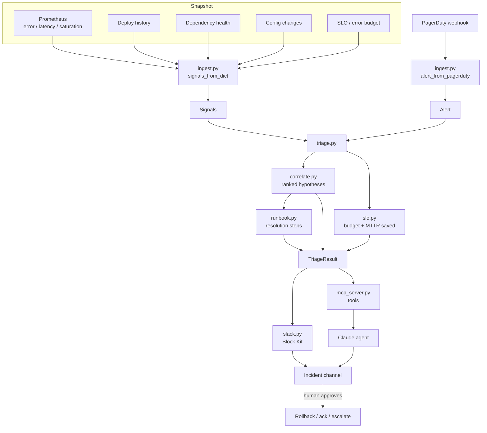

# Architecture

Layered so the **correlation logic** is pure and testable and the **agent
surface** (skill / MCP) is a thin adapter. An LLM never sees raw telemetry — it
calls typed tools that return a ranked, evidence-carrying RCA.

## Why this shape

**Correlation is separated from the agent.** `correlate.py`, `runbook.py`, and
`slo.py` have zero dependency on `mcp`, Slack, or any LLM. The judgment that
matters during an incident — which cause is most likely, which action to
propose — is deterministic and unit-tested. The agent orchestrates and
communicates; it does not invent the RCA.

**Recency and magnitude, not vibes.** Confidence is a bounded function of how
recently something changed and how large the anomaly is. That mirrors how a good
responder reasons and makes every score explainable.

**Propose, don't auto-remediate.** Destructive steps (rollback, drain) and
PagerDuty writes sit behind a human confirmation. Auto-remediation that's wrong
turns one incident into two — the whole value here is a faster *human* decision,
not an unsupervised one.

**Evidence travels with every hypothesis.** Because the output lands in an
incident channel and a post-mortem, each finding names the signal behind it.
"The model said so" is not an audit trail.
